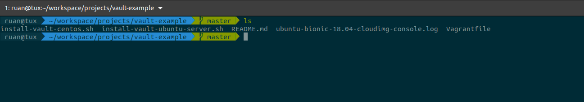
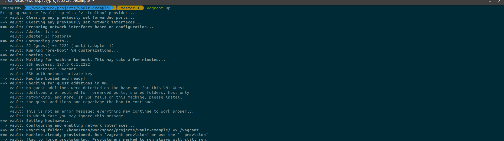
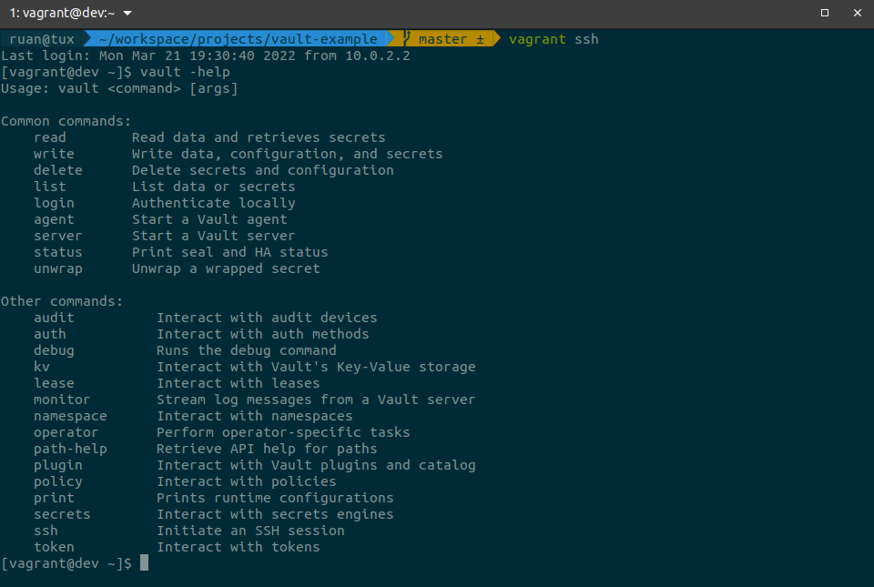
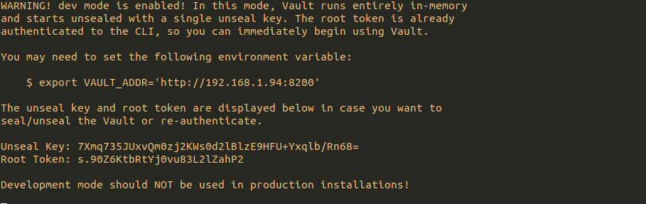
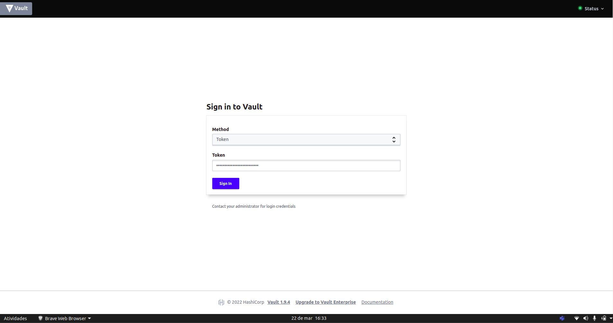
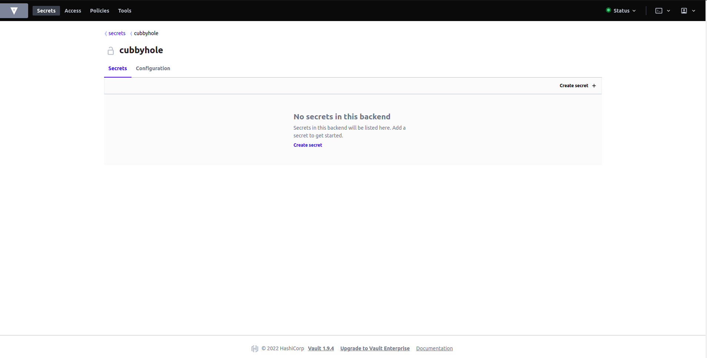

# Repositório de estudo referente a ferramenta vault

## 🚀 Sobre a aplicação

Nesta aplicação foi realizada a criação de um ambiente simples utilizando [vagrant](https://www.vagrantup.com/) com duas opções de server's ou box's linux: [centos7](https://app.vagrantup.com/centos/boxes/7) e [ubuntu-server 18.04](https://app.vagrantup.com/boxes/search?utf8=%E2%9C%93&sort=downloads&provider=&q=bionic), ambas LTS para instalação / estudo da ferramenta [vault](https://www.vaultproject.io/).

## 👀 Sobre as ferramentas utilizadas no projeto

O [Vault](https://www.vaultproject.io/downloads) é secret manager que tem como finalidade gerenciar segredos, proteger dados confidencias, armazenamento de controle e de acesso a tokens como: senhas, certificados, chaves de criptografia para proteger segredos e outros dados confidenciais usando uma interface de usuário ( WEB ), CLI ou API HTTP.

O [Vagrant](https://www.vagrantup.com/downloads) é um software de código aberto para criar e manter ambientes de desenvolvimento virtuais portáteis, utilizando VirtualBox, KVM, Hyper-V, Docker containers, VMware, e AWS. Ele tenta simplificar a gerência de configuração de software das virtualizações para aumentar a produtividade do desenvolvimento.

O [VirtualBox](https://www.virtualbox.org/wiki/Downloads) é um software de virtualização desenvolvido Oracle que, como o VMware Workstation, visa criar ambientes para instalação de sistemas distintos. 


## Como utilizar 🤔

Primeiramente clone este repositório.

| https://github.com/ruanvalente/vault-example

Agora com o repositório clonado precisamos instalar algumas dependências para o projeto como: [virtualbox](https://www.virtualbox.org/wiki/Downloads) e o [vagrant](https://www.vagrantup.com/downloads).

| OBS: Escolha o download correspondente a sua versão do sistema operacional.

Agora com as dependências instaladas vamos executar o projeto. Entre na pasta `vault-example` 



e rode o comando `vagrant up` e aguarde a sua box subir :smile:

## Acessando o ambiente via SSH 👨‍💻

Após o ambiente com a box estiver disponível, podemos usar o comando `vagrant ssh` para conectar na máquina.



Com isso podemos usar o `vault` :smile:

## Executando o vault via UI (WEB) 🤯

Podemos acessar o vault de algumas formas usando a sua `cli`, `API` ou `ui (web)`

| em modo dev podemos utilizar a interface web sem precisar configurar.

```
vault server -dev -dev-listen-address='IP_SERVER:8200'
```

| OBS: Por padrão a porta que o vault utilizar é a `8200`




Agora precisamos **exportar** a variável de ambiente **VAULT_ADDR** pois como estamos em ambiente de desenvolvimento queremos acessar como http e não como https.

| export VAULT_ADDR='http:IP_SERVER:8200'

agora basta acessar a página web usando o ip do servidor copiando o **Root Token** que é disponibilizado pelo vault.




## Documentação 📄

**Vault**:
- [Vault Documentação](https://www.vaultproject.io/docs)
- [Vault 101 - Aplicando Segurança na infraestrutura como Código](https://www.youtube.com/watch?v=LqasYmhzN1s&list=PLC1zVkDH3uircsKtst01i0pAyvWRbJcEN&index=4)
- [Vault 101 - Utilizando Infraestrutura como Código para Desenvolvimento e Estudo](https://www.youtube.com/watch?v=PX6OmeIbjC4)
- [Vault 101 - Aplicando Segurança na infraestrutura como Código artigo](https://caiodelgado.dev/vault-101/)
- [Conhecendo Hashicorp Vault](https://www.youtube.com/watch?v=Slf6kl_8XLg)

**Vagrant**:
- [Vagrant Documentação](https://www.vagrantup.com/docs)
- [Vagrant: Criando Máquinas Virtuais com Um Comando](https://www.vagrantup.com/docs)

